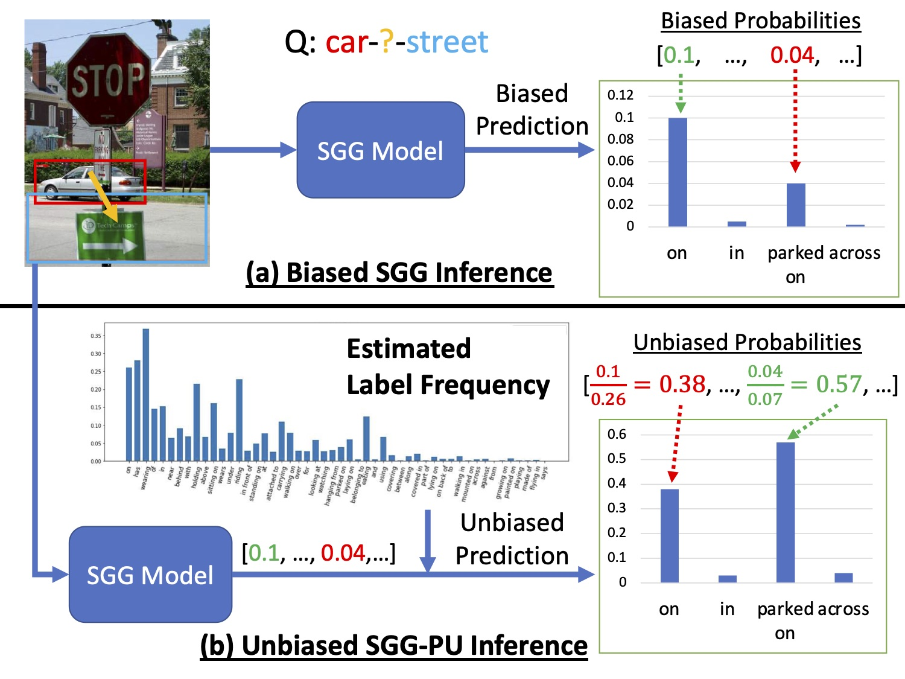
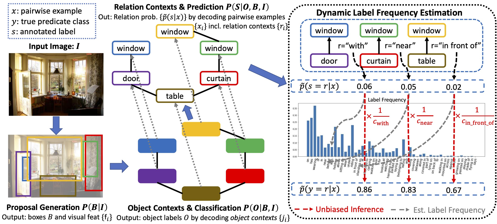
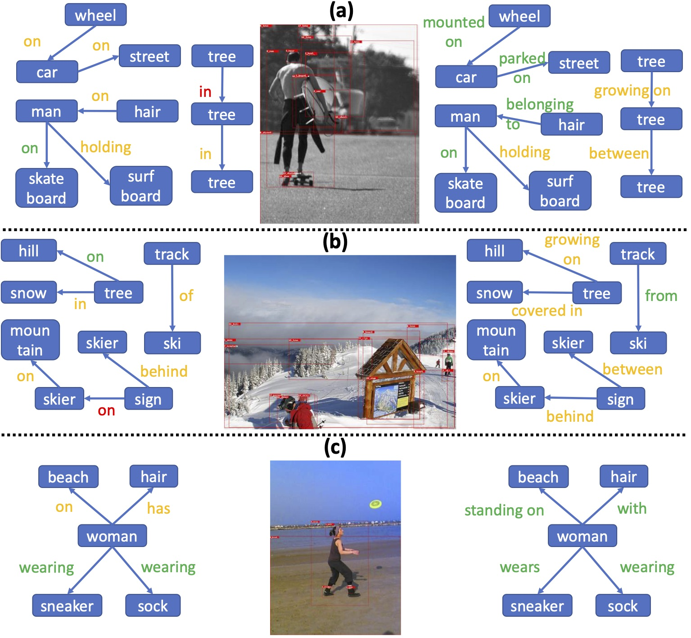
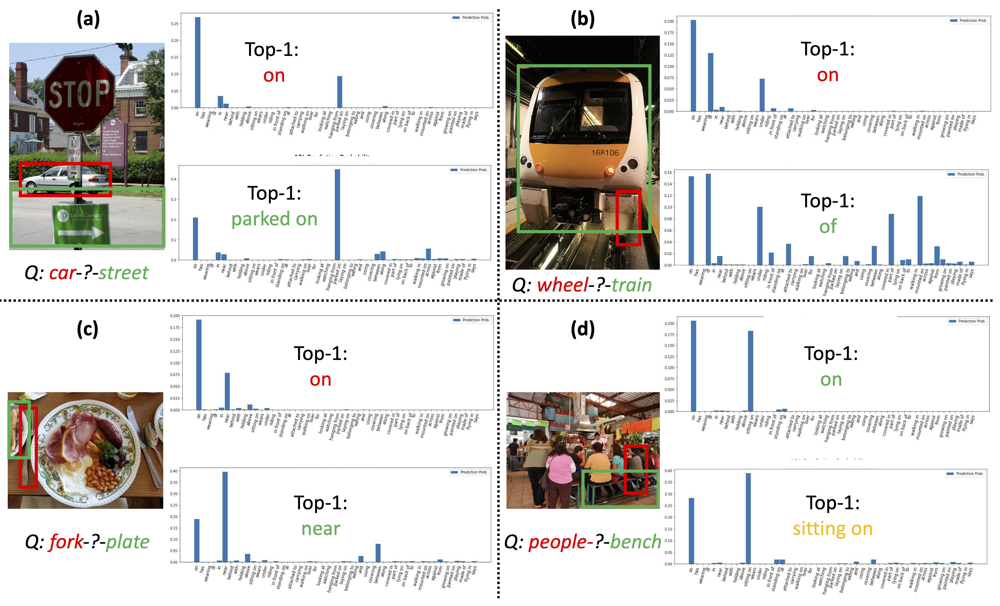

# Recovering the Unbiased Scene Graphs from the Biased Ones (ACMMM 2021)
<!-- Official implementation of "Recovering the Unbiased Scene Graphs from the Biased Ones" (ACMMM 2021) -->

<div align="center">
    
[](https://paperswithcode.com/sota/unbiased-scene-graph-generation-on-visual?p=recovering-the-unbiased-scene-graphs-from-the)
    
**Recovering the Unbiased Scene Graphs from the Biased Ones**<br>
[[arXiv Paper]](https://arxiv.org/pdf/2107.02112.pdf) [[Proceeding Paper]](https://dl.acm.org/doi/pdf/10.1145/3474085.3475297) [[Slides]](files/slides.pdf) [[Poster]](files/poster.pdf) [[Video]](https://dl.acm.org/doi/10.1145/3474085.3475297#sec-supp)<br><br>
[Meng-Jiun Chiou](http://coldmanck.github.io/)<sup>1</sup>, [Henghui Ding](https://henghuiding.github.io/)<sup>2</sup>, [Hanshu Yan](https://sites.google.com/view/hanshuyan/home)<sup>1</sup>, [Changhu Wang](https://changhu.wang/)<sup>2</sup>, [Roger Zimmermann](https://www.comp.nus.edu.sg/~rogerz/roger.html)<sup>1</sup> and [Jiashi Feng](https://sites.google.com/site/jshfeng/home)<sup>1</sup><br>
<sup>1</sup>[National University of Singapore](https://www.nus.edu.sg/) <sup>2</sup>[ByteDance AI Lab](https://ailab.bytedance.com/)
</div>

<div align="center">
    <br>
    "<i>A simple yet elegant way to enrich scene graphs by removing reporting biases.</i>"
</div>


## Introduction
Given input images, scene graph generation (SGG) aims to produce comprehensive, graphical representations describing visual relationships among salient objects. Recently, more efforts have been paid to the long tail problem in SGG; however, the imbalance in the fraction of missing labels of different classes, or reporting bias, exacerbating the long tail is rarely considered and cannot be solved by the existing debiasing methods. In this paper we show that, due to the missing labels, SGG can be viewed as a "Learning from Positive and Unlabeled data" (PU learning) problem, where the reporting bias can be removed by recovering the unbiased probabilities from the biased ones by utilizing label frequencies, i.e., the per-class fraction of labeled, positive examples in all the positive examples. To obtain accurate label frequency estimates, we propose Dynamic Label Frequency Estimation (DLFE) to take advantage of training-time data augmentation and average over multiple training iterations to introduce more valid examples. Extensive experiments show that DLFE is more effective in estimating label frequencies than a naive variant of the traditional estimate, and DLFE significantly alleviates the long tail and achieves state-of-the-art debiasing performance on the VG dataset. We also show qualitatively that SGG models with DLFE produce prominently more balanced and unbiased scene graphs.

<div align="center">
    
</div>

## Visualizing Debiased Scene Graphs
(Click to see enlarged images!)

| | |
|:-------------------------:|:-------------------------:|
| Left/Right: Biased/Debiased Scene Graphs |   Top/Bottom: Biased/Debiased Predicate Confidence Distribution |

## Installation
Prerequisites for starting a training/validation session:
- 2x NVIDIA GPUs with at least 16G memory each (for training); or 1x NVIDIA GPU with at least 4G memory (for validation)
- CUDA/cudnn installed (with version matched your PyTorch)

Note that we use PyTorch 1.8.0 (should be compatible with versions 0.4.0 ~ 1.9.0) with CUDA 11.1. The installation of PyTorch is included in the following script.

We provide two ways to install:
- (Recommended) Run `bash install_sgg_env.sh`. That's it! Any doubt, run the commands one-by-one.
- Follow [INSTALL.md](INSTALL.md) to install the requirements step-by-step.

## Data
Please refer to [DATASET.md](DATASET.md) for downloading the Visual Genome dataset.

## Models
Note that as of now the codebase is still pretty messy, but there is no plan for refactoring the codebase currently. Feel free to open a PR if you want to fix any bug or want to help the codebase clearer!

First of all, enter the environment you just create by `conda activate scene_graph_benchmark`. 

Note that before running any of the following command, ensure you have the following options fixed (see [defaults.py](maskrcnn_benchmark/config/defaults.py) for complete options and their default values):
- `--master_port`: you have to choose a different port for each (training/testing) command. For example, if you already have one command running with `--master_port 10025`, you'd need to pass another port like `--master_port 10026` when you start another command.
- `CUDA_VISIBLE_DEVICES`: choose the GPUs that you are going to use. For example, `CUDA_VISIBLE_DEVICES=0,1` use the first two GPUs.
- `--nproc_per_node`: this should correspond to the number of GPUs you used for each command. For example, if you pass `CUDA_VISIBLE_DEVICES=0,1`, you should also pass `--nproc_per_node 2`. 
- `TEST.IMS_PER_BATCH`: For experiments in PredCls mode, the default value is `48`; however, for experiments in SGCls & SGDet modes (excl. PredCls mode), following the existing codebase we only evaluate **one** image on each GPU. That is, for training/validation experiments in SGCls/SGDet mode, if you pass `CUDA_VISIBLE_DEVICES=0,1` and `--nproc_per_node 2`, you should pass `TEST.IMS_PER_BATCH 2`.
- `MODEL.ROI_RELATION_HEAD.USE_GT_BOX` and `MODEL.ROI_RELATION_HEAD.USE_GT_OBJECT_LABEL`: For all commands listed below, the **PredCls** mode is used by default and thus both these two options are set as `True`. To change to **SGCls**, pass `MODEL.ROI_RELATION_HEAD.USE_GT_OBJECT_LABEL False` while keep `MODEL.ROI_RELATION_HEAD.USE_GT_OBJECT_LABEL True`. To change to **SGDet**, set the both options to `False`. If you don't understand the differences between these three modes, refer to the paper for details.
- `OUTPUT_DIR`: this option is not only meant for the output directory but also the name of the experiment. Remember to modify accordingly. For example, `output/motif-precls-exmp-pcpl` means the *PCPL* model with *MOTIFS* backbone trained in *PredCls* mode.
- `MODEL.ROI_RELATION_HEAD.PREDICTOR`: For all commands listed below, the MOTIFS SGG backbone (`MotifPredictor`) is used by default. Change to `VCTreePredictor` to use the VCTree backbone.

For the MOTIFS baseline and MOTIFS-DLFE, we provide the trained models (checkpoint) for verification purpose. Please download from [here](https://drive.google.com/file/d/19n2Z8udljxgSpDwG8vPRWSEe76GzL9DM/view?usp=sharing)* and unzip to `output/` under the root folder of this codebase, followed by running the following validation commands. *Use [gdown](https://github.com/wkentaro/gdown) if needed :)

### Baseline (Backbone Only)
- Training
```
CUDA_VISIBLE_DEVICES=0,1 python -m torch.distributed.launch --master_port 10025 --nproc_per_node=2 tools/relation_train_net.py --config-file "configs/e2e_relation_X_101_32_8_FPN_1x.yaml" MODEL.ROI_RELATION_HEAD.USE_GT_BOX True MODEL.ROI_RELATION_HEAD.USE_GT_OBJECT_LABEL True MODEL.ROI_RELATION_HEAD.PREDICTOR MotifPredictor SOLVER.IMS_PER_BATCH 48 TEST.IMS_PER_BATCH 2 DTYPE "float16" SOLVER.MAX_ITER 50000 SOLVER.VAL_PERIOD 2000 SOLVER.CHECKPOINT_PERIOD 2000 GLOVE_DIR glove MODEL.PRETRAINED_DETECTOR_CKPT checkpoints/pretrained_faster_rcnn/model_final.pth OUTPUT_DIR output/motif-precls-exmp SOLVER.PRE_VAL True
```

- Validation
```
CUDA_VISIBLE_DEVICES=0 python -m torch.distributed.launch --master_port 10025 --nproc_per_node=1 tools/relation_test_net.py --config-file "configs/e2e_relation_X_101_32_8_FPN_1x.yaml" MODEL.ROI_RELATION_HEAD.USE_GT_BOX True MODEL.ROI_RELATION_HEAD.USE_GT_OBJECT_LABEL True MODEL.ROI_RELATION_HEAD.PREDICTOR MotifPredictor TEST.IMS_PER_BATCH 48 DTYPE "float16" GLOVE_DIR glove MODEL.PRETRAINED_DETECTOR_CKPT checkpoints/pretrained_faster_rcnn/model_final.pth OUTPUT_DIR output/motif-precls-exmp
```

### DLFE (Dynamic Label Frequency Estimation)
Note that `balanced_norm` here means the proposed DLFE in our paper.

- Training
```
CUDA_VISIBLE_DEVICES=0,1 python -m torch.distributed.launch --master_port 10025 --nproc_per_node=2 tools/relation_train_net.py --config-file "configs/e2e_relation_X_101_32_8_FPN_1x.yaml" MODEL.ROI_RELATION_HEAD.USE_GT_BOX True MODEL.ROI_RELATION_HEAD.USE_GT_OBJECT_LABEL True MODEL.ROI_RELATION_HEAD.PREDICTOR MotifPredictor SOLVER.IMS_PER_BATCH 48 TEST.IMS_PER_BATCH 2 DTYPE "float16" SOLVER.MAX_ITER 50000 SOLVER.VAL_PERIOD 2000 SOLVER.CHECKPOINT_PERIOD 2000 GLOVE_DIR glove MODEL.PRETRAINED_DETECTOR_CKPT checkpoints/pretrained_faster_rcnn/model_final.pth OUTPUT_DIR output/motif-precls-exmp-balanced_norm LOG_TB True SOLVER.PRE_VAL True MODEL.BALANCED_NORM True
```

- Validation
```
CUDA_VISIBLE_DEVICES=0 python -m torch.distributed.launch --master_port 10025 --nproc_per_node=1 tools/relation_test_net.py --config-file "configs/e2e_relation_X_101_32_8_FPN_1x.yaml" MODEL.ROI_RELATION_HEAD.USE_GT_BOX True MODEL.ROI_RELATION_HEAD.USE_GT_OBJECT_LABEL True MODEL.ROI_RELATION_HEAD.PREDICTOR MotifPredictor TEST.IMS_PER_BATCH 48 DTYPE "float16" GLOVE_DIR glove MODEL.PRETRAINED_DETECTOR_CKPT checkpoints/pretrained_faster_rcnn/model_final.pth OUTPUT_DIR output/motif-precls-exmp-balanced_norm MODEL.BALANCED_NORM True
```

### Other (Re-)implemented Models 
Apart from baseline and DLFE, we also provide my implementation for training and testing the following SGG debiasing models based on either MOTIFS or VCTree backbone (click to unfold):

<details>
<summary>
Reweighting (with weights of inversed sqrt predicate frequency)
</summary>

- Training
```
CUDA_VISIBLE_DEVICES=0,1 python -m torch.distributed.launch --master_port 10025 --nproc_per_node=2 tools/relation_train_net.py --config-file "configs/e2e_relation_X_101_32_8_FPN_1x.yaml" MODEL.ROI_RELATION_HEAD.USE_GT_BOX True MODEL.ROI_RELATION_HEAD.USE_GT_OBJECT_LABEL True MODEL.ROI_RELATION_HEAD.PREDICTOR MotifPredictor SOLVER.IMS_PER_BATCH 48 TEST.IMS_PER_BATCH 2 DTYPE "float16" SOLVER.MAX_ITER 50000 SOLVER.VAL_PERIOD 2000 SOLVER.CHECKPOINT_PERIOD 2000 GLOVE_DIR glove MODEL.PRETRAINED_DETECTOR_CKPT checkpoints/pretrained_faster_rcnn/model_final.pth OUTPUT_DIR output/motif-precls-exmp-reweight_sqrt LOG_TB True SOLVER.PRE_VAL True TRAIN.UNBIASED_TRAINING reweight TRAIN.PREDICATE_WEIGHTS_PATH datasets/vg/predicate_weights_sqrt.pkl
```

- Validation
```
CUDA_VISIBLE_DEVICES=0 python -m torch.distributed.launch --master_port 10025 --nproc_per_node=1 tools/relation_test_net.py --config-file "configs/e2e_relation_X_101_32_8_FPN_1x.yaml" MODEL.ROI_RELATION_HEAD.USE_GT_BOX True MODEL.ROI_RELATION_HEAD.USE_GT_OBJECT_LABEL True MODEL.ROI_RELATION_HEAD.PREDICTOR MotifPredictor TEST.IMS_PER_BATCH 48 DTYPE "float16" GLOVE_DIR glove MODEL.PRETRAINED_DETECTOR_CKPT checkpoints/pretrained_faster_rcnn/model_final.pth OUTPUT_DIR output/motif-precls-exmp-reweight_sqrt
```

</details>

<details>
<summary>
TDE (Total Direct Effect)
</summary>

Note that `MODEL.ROI_RELATION_HEAD.PREDICTOR CausalAnalysisPredictor` is fixed for TDE. To change the backbone model to VCTree, pass `MODEL.ROI_RELATION_HEAD.CAUSAL.CONTEXT_LAYER vctree`. Refer to the [original paper](https://arxiv.org/abs/2002.11949) for more details.

- Training
```
CUDA_VISIBLE_DEVICES=0,1 python -m torch.distributed.launch --master_port 10025 --nproc_per_node=2 tools/relation_train_net.py --config-file "configs/e2e_relation_X_101_32_8_FPN_1x.yaml" MODEL.ROI_RELATION_HEAD.USE_GT_BOX True MODEL.ROI_RELATION_HEAD.USE_GT_OBJECT_LABEL True MODEL.ROI_RELATION_HEAD.PREDICTOR CausalAnalysisPredictor MODEL.ROI_RELATION_HEAD.CAUSAL.EFFECT_TYPE none MODEL.ROI_RELATION_HEAD.CAUSAL.FUSION_TYPE sum MODEL.ROI_RELATION_HEAD.CAUSAL.CONTEXT_LAYER motifs SOLVER.IMS_PER_BATCH 12 TEST.IMS_PER_BATCH 2 DTYPE "float16" SOLVER.MAX_ITER 50000 SOLVER.VAL_PERIOD 2000 SOLVER.CHECKPOINT_PERIOD 2000 GLOVE_DIR glove MODEL.PRETRAINED_DETECTOR_CKPT checkpoints/pretrained_faster_rcnn/model_final.pth OUTPUT_DIR output/motifs-precls-exmp-causal LOG_TB True
```

- Validation
```
CUDA_VISIBLE_DEVICES=0 python -m torch.distributed.launch --master_port 10025 --nproc_per_node=1 tools/relation_test_net.py --config-file "configs/e2e_relation_X_101_32_8_FPN_1x.yaml" MODEL.ROI_RELATION_HEAD.USE_GT_BOX True MODEL.ROI_RELATION_HEAD.USE_GT_OBJECT_LABEL True MODEL.ROI_RELATION_HEAD.PREDICTOR CausalAnalysisPredictor MODEL.ROI_RELATION_HEAD.CAUSAL.EFFECT_TYPE TDE MODEL.ROI_RELATION_HEAD.CAUSAL.FUSION_TYPE sum MODEL.ROI_RELATION_HEAD.CAUSAL.CONTEXT_LAYER motifs TEST.IMS_PER_BATCH 1 DTYPE "float16" GLOVE_DIR glove MODEL.PRETRAINED_DETECTOR_CKPT checkpoints/pretrained_faster_rcnn/model_final.pth OUTPUT_DIR output/motifs-precls-exmp-causal
```

</details>

<details>
<summary>
PCPL (Predicate-Correlation Perception Learning)
</summary>

Refer to the [original paper](https://arxiv.org/abs/2009.00893) for more details.

- Training
```
CUDA_VISIBLE_DEVICES=0,1 python -m torch.distributed.launch --master_port 10025 --nproc_per_node=2 tools/relation_train_net.py --config-file "configs/e2e_relation_X_101_32_8_FPN_1x.yaml" MODEL.ROI_RELATION_HEAD.USE_GT_BOX True MODEL.ROI_RELATION_HEAD.USE_GT_OBJECT_LABEL True MODEL.ROI_RELATION_HEAD.PREDICTOR MotifPredictor SOLVER.IMS_PER_BATCH 48 TEST.IMS_PER_BATCH 2 DTYPE "float16" SOLVER.MAX_ITER 50000 SOLVER.VAL_PERIOD 2000 SOLVER.CHECKPOINT_PERIOD 2000 GLOVE_DIR glove MODEL.PRETRAINED_DETECTOR_CKPT checkpoints/pretrained_faster_rcnn/model_final.pth OUTPUT_DIR output/motif-precls-exmp-pcpl LOG_TB True SOLVER.PRE_VAL True MODEL.PCPL_CENTER_LOSS True
```

- Validation
```
CUDA_VISIBLE_DEVICES=0 python -m torch.distributed.launch --master_port 10025 --nproc_per_node=1 tools/relation_test_net.py --config-file "configs/e2e_relation_X_101_32_8_FPN_1x.yaml" MODEL.ROI_RELATION_HEAD.USE_GT_BOX True MODEL.ROI_RELATION_HEAD.USE_GT_OBJECT_LABEL True MODEL.ROI_RELATION_HEAD.PREDICTOR MotifPredictor TEST.IMS_PER_BATCH 1 DTYPE "float16" GLOVE_DIR glove MODEL.PRETRAINED_DETECTOR_CKPT checkpoints/pretrained_faster_rcnn/model_final.pth OUTPUT_DIR output/motif-precls-exmp-pcpl
```

</details>

<details>
<summary>
STL (Soft Transfer Learning)
</summary>
    
Note that the learning rate for STL model is 10x smaller than the others. The file `train_labeling_prob_raw.pt` should be generated after training STL models. 
    
Note that the file `train_eval_results.pytorch` have to be generated in advance (before training), by evaluating/inference any of the SGG model with [the validation script](https://github.com/coldmanck/recovering-unbiased-scene-graphs/blob/c0586c4805a2a3f88edf40ffbd04db77c82611f5/maskrcnn_benchmark/engine/inference.py#L105-L123). For the case of STL, if you need `output/motif-precls-exmp/inference/VG_stanford_filtered_with_attribute_test/train_eval_results.pytorch`, you have to inference the trained SGG model of `motifs-precls-exmp`. Refer to [the original paper](https://ieeexplore.ieee.org/abstract/document/8658599) for more details.

- Training
```
CUDA_VISIBLE_DEVICES=0,1 python -m torch.distributed.launch --master_port 10025 --nproc_per_node=2 tools/relation_train_net.py --config-file "configs/e2e_relation_X_101_32_8_FPN_1x.yaml" MODEL.ROI_RELATION_HEAD.USE_GT_BOX True MODEL.ROI_RELATION_HEAD.USE_GT_OBJECT_LABEL True MODEL.ROI_RELATION_HEAD.PREDICTOR MotifPredictor SOLVER.IMS_PER_BATCH 12 TEST.IMS_PER_BATCH 2 DTYPE "float16" SOLVER.MAX_ITER 50000 SOLVER.VAL_PERIOD 2000 SOLVER.CHECKPOINT_PERIOD 2000 GLOVE_DIR glove MODEL.PRETRAINED_DETECTOR_CKPT checkpoints/pretrained_faster_rcnn/model_final.pth OUTPUT_DIR output/motif-precls-exmp-stl-correct-10xslr LOG_TB True SOLVER.PRE_VAL True MODEL.STL_TRAIN True MODEL.STL_TRAIN_LABEL_PATH output/motif-precls-exmp/inference/VG_stanford_filtered_with_attribute_test/train_eval_results.pytorch SOLVER.BASE_LR 0.001
```

- Validation
```
CUDA_VISIBLE_DEVICES=0 python -m torch.distributed.launch --master_port 10025 --nproc_per_node=1 tools/relation_test_net.py --config-file "configs/e2e_relation_X_101_32_8_FPN_1x.yaml" MODEL.ROI_RELATION_HEAD.USE_GT_BOX True MODEL.ROI_RELATION_HEAD.USE_GT_OBJECT_LABEL True MODEL.ROI_RELATION_HEAD.PREDICTOR MotifPredictor TEST.IMS_PER_BATCH 48 DTYPE "float16" GLOVE_DIR glove MODEL.PRETRAINED_DETECTOR_CKPT checkpoints/pretrained_faster_rcnn/model_final.pth OUTPUT_DIR output/motif-precls-exmp-stl-correct-10xslr TEST.STL_MODE True TEST.STL_TRAINING_SET_LABELING_PROB output/motif-precls-exmp/inference/VG_stanford_filtered_with_attribute_test/train_labeling_prob_raw.pt
```

</details>

## Citation
```
@inproceedings{chiou2021recovering,
    title={Recovering the Unbiased Scene Graphs from the Biased Ones},
    author={Chiou, Meng-Jiun and Ding, Henghui and Yan, Hanshu and Wang, Changhu and Zimmermann, Roger and Feng, Jiashi},
    booktitle={Proceedings of the 29th ACM International Conference on Multimedia},
    pages={1581–-1590},
    year={2021}
}
```

## Credits
Our codebase is based on [Scene-Graph-Benchmark.pytorch](https://github.com/KaihuaTang/Scene-Graph-Benchmark.pytorch).

## Enquiry
Please check if your issue has been addressed in the discussions of the Issue section of this repository. Otherwise, feel free to open an issue or drop an email to mengjiun.chiou at u.nus.edu
